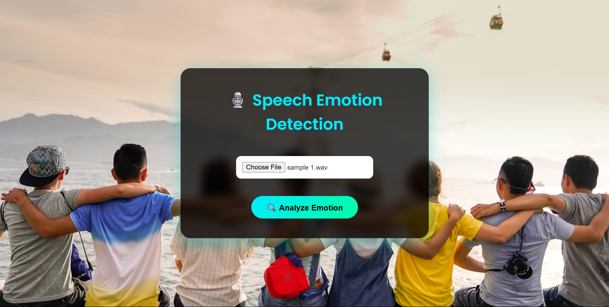
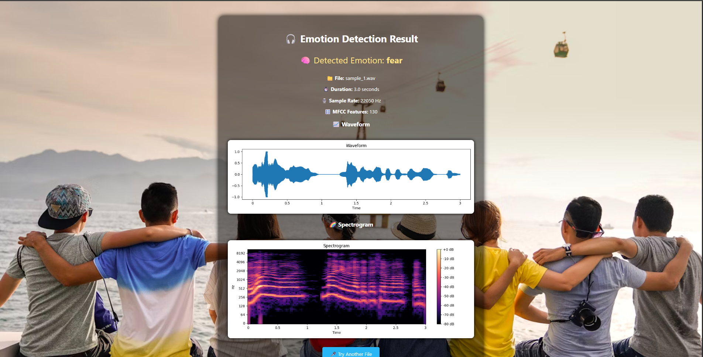

<<<<<<< Updated upstream
# 🌍 Multilingual Speech Emotion Recognition 🎙️🧠
=======
##Project Overview
>>>>>>> Stashed changes

A machine learning and deep learning-based project for detecting emotions from speech across **multiple languages** using advanced **audio processing** and **neural network architectures**.

<<<<<<< Updated upstream
---
=======
##Features
>>>>>>> Stashed changes

## 📌 Project Overview

This project classifies emotions from speech audio samples across various languages. It extracts powerful acoustic features (MFCCs, Chroma, Mel Spectrograms) and applies both **machine learning** and **deep learning** models to recognize emotions like happiness, sadness, anger, and neutrality.

---

## 🚀 Features

* ✅ Multilingual support (English, Spanish, French, etc.)
* ✅ Emotion detection: **Happy**, **Sad**, **Angry**, **Neutral**, etc.
* ✅ Advanced audio feature extraction using `Librosa`
* ✅ ML Models: SVM, Random Forest, XGBoost
* ✅ DL Models: CNN, LSTM, Transformers
* ✅ Scalable for **real-time** emotion detection applications

<<<<<<< Updated upstream
---
=======
##Datasets
>>>>>>> Stashed changes

## 📂 Dataset

<<<<<<< Updated upstream
* **Toronto Emotional Speech Set (TESS)**
  Includes speech samples from two female actors, simulating various emotions across multiple sentences.

---

## 🛠️ Installation
=======
##Installation
>>>>>>> Stashed changes

Clone the repository:

```bash
git clone https://github.com/Anand-b-patil/Multilingual-speech-emotion-recognition-using-MFCC.git
cd Multilingual-speech-emotion-recognition-using-MFCC
```

Install the dependencies:

```bash
pip install -r requirements.txt
```

---

## 🎼 Feature Extraction

Features are extracted using **Librosa**:

* 🎵 **MFCC** (Mel Frequency Cepstral Coefficients)
* 🎼 **Chroma Frequencies**
* 🌈 **Mel Spectrograms**

---

## 🧠 Models Used

### 🛠 Machine Learning Models

* 🔹 Support Vector Machine (SVM)
* 🔹 Random Forest
* 🔹 XGBoost

### 🤖 Deep Learning Models

* 🧱 Convolutional Neural Networks (CNN)
* ⏳ Long Short-Term Memory (LSTM)
* 🧠 Transformer-based Architectures

---

## 📊 Results

* ✅ High accuracy for emotion detection across languages
* 🔬 Robust performance on multiple datasets
* 🚀 Ready for future **real-time deployment** potential

---

## 🎯 Sample Prediction Outputs

<div align="center">
  
  <br/>
  <em>Emotion Prediction Interface</em>
</div>

<div align="center">
  
  <br/>
  <em>Prediction Results Display</em>
</div>

````markdown

# 🌍 Multilingual Speech Emotion Recognition 🎙️🧠

A machine learning and deep learning project for detecting emotions from speech across multiple languages using advanced audio processing and neural network architectures.

---

## � Project Overview

This project classifies emotions from speech audio samples across various languages. It extracts acoustic features (MFCCs, Chroma, Mel Spectrograms) and applies both machine learning and deep learning models to recognize emotions like happiness, sadness, anger, and neutrality.

---

## � Features

* Multilingual support (English, Spanish, French, etc.)
* Emotion detection: Happy, Sad, Angry, Neutral, Surprise, Disgust, Fear
* Audio feature extraction using `librosa`
* ML Models: SVM, Random Forest, XGBoost
* DL Models: CNN, LSTM, Transformer-based architectures
* Ready for extension to real-time emotion detection

---

## 📂 Dataset

* Toronto Emotional Speech Set (TESS) — samples from multiple actors covering several emotions

---

## 🛠️ Installation

Clone the repository and install dependencies:

```powershell
git clone https://github.com/Anand-b-patil/Multilingual-speech-emotion-recognition-using-MFCC.git
cd Multilingual-speech-emotion-recognition-using-MFCC
pip install -r requirements.txt
```

---

## 🎼 Feature Extraction

Features are extracted using `librosa`:

* MFCC (Mel Frequency Cepstral Coefficients)
* Chroma Frequencies
* Mel Spectrograms

---

## 🧠 Models Used

### Machine Learning Models
* Support Vector Machine (SVM)
* Random Forest
* XGBoost

### Deep Learning Models
* Convolutional Neural Networks (CNN)
* Long Short-Term Memory (LSTM)
* Transformer-based Architectures

---

## 📊 Results

The project demonstrates competitive accuracy across selected datasets and is structured for future improvements towards real-time deployment.

---

## 🎯 Sample Prediction Outputs

<div align="center">
  
  <br/>
  <em>Emotion Prediction Interface</em>
</div>

<div align="center">
  
  <br/>
  <em>Prediction Results Display</em>
</div>

---

## 🧭 Future Improvements

* Add real-time streaming audio emotion detection
* Expand dataset to include more languages and speakers
* Optimize deep models for lower-latency inference

---

## 📦 Tech Stack & Libraries

| Tool         | Version |
| ------------ | ------- |
| Python       | 3.8+    |
| NumPy        | 1.24+   |
| Pandas       | 1.5+    |
| Librosa      | 0.10+   |
| scikit-learn | 1.2+    |
| XGBoost      | 1.7+    |
| TensorFlow   | 2.x     |
| Matplotlib   | 3.x     |

---

## 📜 License

This project is licensed under the MIT License. See the `LICENSE` file for details.

---

## 🙌 Acknowledgements

* TESS Dataset — Toronto Emotional Speech Set
* Librosa — audio analysis
* TensorFlow & scikit-learn — modeling

````
